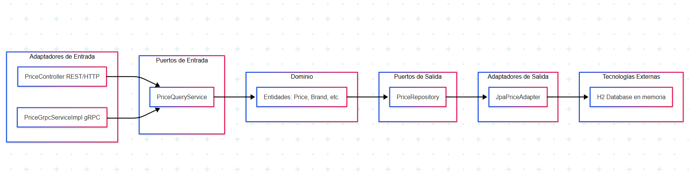

# Proyecto:
`ecommerce-prices` (Servicio de Precios gRPC/Web)

Este proyecto es un servicio de precios que expone APIs tanto a través de gRPC como de servicios web HTTP/REST. Permite consultar precios de productos considerando la fecha de aplicación y la marca.

-----
## 🔖 Versionado

El proyecto sigue [Semantic Versioning](https://semver.org/). La versión actual es `0.0.1-SNAPSHOT`.

----- 
## 📋 Requisitos Previos
Para construir y ejecutar este proyecto localmente, necesitas tener instaladas las siguientes herramientas:
- **Java 17** (JDK)
- **Maven 3.8.x** o superior
- **Docker** (versión 20.x o superior)
- **kubectl** (si planeas trabajar con Kubernetes localmente)
- **Git** (para clonar el repositorio)

-----

## 🚀 Tecnologías Utilizadas

* **Java 17**
* **Spring Boot 3.x**
* **gRPC** (con `net.devh` Spring Boot gRPC Starter)
* **Maven**
* **Docker**
* **Kubernetes**

-----
## 📖 Descripción del Proyecto

Este proyecto ha sido desarrollado utilizando un conjunto de tecnologías robustas para garantizar rendimiento, escalabilidad y mantenibilidad:

* **Lenguaje y Framework:** **Java 17** con **Spring Boot 3.x**.
* **Comunicación de Servicios:**
    * **gRPC:** Implementado para una comunicación inter-servicio de alta eficiencia y baja latencia, ideal para el backend y servicios críticos.
    * **REST/HTTP:** Expuesto en un puerto dedicado para la interacción con clientes web y externos que requieren una interfaz HTTP estándar.
* **Gestión de Datos:** **SQL** a través de **Spring Data JPA** para la persistencia de datos relacionales, facilitando las operaciones CRUD.
* **Contenerización:** **Docker** para empaquetar la aplicación y sus dependencias en imágenes ligeras y portables, asegurando entornos consistentes.
* **Orquestación:** **Kubernetes** para la orquestación de contenedores, gestión de réplicas, balanceo de carga y autoescalado (Horizontal Pod Autoscaler - HPA) en entornos de alta concurrencia.

---

### 🛡️ Arquitectura Implementada: Hexagonal (Puertos y Adaptadores) con DDD



La aplicación sigue una **Arquitectura Hexagonal**, también conocida como Arquitectura de Puertos y Adaptadores, que se complementa con principios de **Domain-Driven Design (DDD)**. Este enfoque asegura un diseño de software desacoplado, altamente testeable y flexible ante cambios tecnológicos.

El principio central es la **separación de preocupaciones**, aislando la lógica de negocio central de las implementaciones tecnológicas externas.

* **El Corazón del Hexágono (Dominio Puro):**
    * **Capa de Dominio (`.domain`):** Es el núcleo inmutable de la aplicación. Contiene la **lógica de negocio pura**, las entidades, agregados, Value Objects y servicios de dominio. Aquí se define el "qué" hace el negocio. **No tiene dependencias de frameworks o bases de datos.**
    * **Capa de Aplicación (`.application`):** Reside justo fuera del dominio. Contiene los **Casos de Uso** (o Servicios de Aplicación) que orquestan las operaciones de negocio. Recibe peticiones externas, las traduce, invoca la lógica del dominio, y coordina las interacciones con la infraestructura a través de los puertos de salida.

* **Los Bordes (Puertos - Las Interfaces):**
    * **Puertos de Entrada (Driving / Primary Ports):** Son interfaces que el centro del hexágono ofrece al mundo exterior (ej. `PriceQueryService`). Definen las operaciones que la aplicación puede realizar.
    * **Puertos de Salida (Driven / Secondary Ports):** Son interfaces que el centro del hexágono necesita del mundo exterior (ej. `PriceRepository`). Definen los contratos para interactuar con bases de datos, sistemas externos, etc.

* **El Exterior (Adaptadores - Las Implementaciones):**
    * **Adaptadores de Entrada (Driving / Primary Adapters):** Implementan los puertos de entrada. Son los mecanismos que inician la interacción con la aplicación. En este proyecto incluyen:
        * **Controladores Web (REST/HTTP):** Manejan las peticiones HTTP/REST (`PriceController`).
        * **Implementaciones del Servicio gRPC:** Gestionan las llamadas gRPC (`PriceGrpcServiceImp`).
    * **Adaptadores de Salida (Driven / Secondary Adapters):** Implementan los puertos de salida. Son los componentes que el dominio o la aplicación invocan para interactuar con sistemas externos. En este proyecto incluyen:
        * **Implementaciones de Persistencia:** Adapters para la base de datos (ej. `JpaPriceAdapter` implementando `PriceRepository`).

**Beneficios Clave de esta Arquitectura:**

* **Desacoplamiento:** La lógica de negocio permanece limpia e independiente de los detalles de la infraestructura.
* **Alta Testabilidad:** Permite probar el dominio y la lógica de aplicación de forma aislada, sin necesidad de levantar servicios externos o bases de datos reales.
* **Flexibilidad:** Facilita la adaptación a nuevas tecnologías o el reemplazo de componentes (ej. cambiar la base de datos) con un impacto mínimo en el código central.
* **Claridad y Mantenibilidad:** La clara separación de responsabilidades hace que el código sea más fácil de entender, mantener y extender por diferentes equipos.
* **Preparación para la Concurrencia:** Al aislar los tipos de tráfico (gRPC vs. HTTP) y permitir despliegues separados, se optimiza la gestión de recursos y la escalabilidad bajo alta concurrencia.

-----

## 🛠️ Construcción Local

Para construir el proyecto localmente, asegúrate de tener Maven y Java 17 instalados.

1.  **Clona el repositorio:**

    ```bash
    git clone https://github.com/mvallsz/ecommerce-prices.git
    cd ecommerce-prices
    ```

2.  **Compila el proyecto:**

    ```bash
    mvn clean install
    ```

    Esto generará el archivo JAR ejecutable en la carpeta `target/`.

3.  **Ejecuta la aplicación:**

    ```bash
    java -jar target/ecommerce-prices-0.0.1-SNAPSHOT.jar # Ajusta el nombre del JAR si es diferente
    ```

    La aplicación se iniciará, exponiendo el servicio gRPC en el puerto `9090` y el servicio web en el puerto `8080`.

-----

## 🧪 Pruebas
El proyecto incluye pruebas unitarias y de integración con JUnit y Mockito. Para ejecutarlas:
```bash
mvn test
```
----

## 🗄️ Base de Datos
Este proyecto utiliza **M2** como base de datos relacional (puedes adaptarlo a otras bases compatibles con JPA). Para configurarla:
1. Crea una base de datos llamada `ecommerce`.
2. Ejecuta el script de inicialización en `src/main/resources/data.sql` (si aplica).
3. Asegúrate de que las credenciales coincidan con las variables de entorno mencionadas en la sección de Configuración.

-----

## 🐳 Dockerización

Para construir una imagen Docker de la aplicación, utiliza el `Dockerfile` proporcionado.

1.  **Asegúrate de tener Docker instalado.**

2.  **Construye la imagen Docker:**

    ```bash
    docker build -t ecommerce-prices:latest .
    ```

3.  **Ejecuta el contenedor Docker (opcional, para pruebas locales):**

    ```bash
    docker run -p 9090:9090 -p 8080:8080 --name ecommerce-prices-app ecommerce-prices:latest
    ```

    Ahora puedes acceder al servicio gRPC en `localhost:9090` y al servicio web en `localhost:8080`.

-----

## 🚀 Despliegue en Kubernetes (AKS)

Este proyecto está configurado para ser desplegado en un clúster de Kubernetes.

### 📁 Archivos de Configuración de Kubernetes

Los manifiestos de Kubernetes se encuentran en la carpeta `kubernetes/`:

* `kubernetes/web-deployment.yaml`: Define el **despliegue web** de la aplicación, especificando las réplicas (inicialmente 3 para multiconcurrencia), los recursos (CPU/memoria) y la imagen Docker.
* * `kubernetes/grpc-deployment.yaml`: Define el **despliegue grpc** de la aplicación, especificando las réplicas (inicialmente 3 para multiconcurrencia), los recursos (CPU/memoria) y la imagen Docker.
* `kubernetes/web-service.yaml && kubernetes/grpc-service.yaml`: Define **dos servicios** para exponer los diferentes tipos de tráfico de la aplicación:
    * **Puerto 9090 (gRPC):** Expuesto como un `LoadBalancer` para acceso externo directo a gRPC (o `ClusterIP` si se usa un Ingress compatible con HTTP/2).
    * **Puerto 8080 (HTTP/Web):** Expuesto como un `LoadBalancer` para el tráfico web (o `ClusterIP` si se usa un Ingress HTTP/HTTPS estándar).
    * **Nota sobre puertos aislados:** Los puertos gRPC y web están aislados para permitir una **escalabilidad independiente** y un mejor balanceo de carga para cada tipo de tráfico.
* `kubernetes/web-hpa.yaml && kubernetes/grpc-hpa.yaml`: Configura un **Horizontal Pod Autoscaler (HPA)** para escalar automáticamente las réplicas del despliegue basándose en el uso de CPU (escalará entre 3 y 10 réplicas cuando el uso de CPU exceda el 70%).

**Asegúrate de actualizar los placeholders** en `kubernetes/deployment.yaml` con el nombre de tu Azure Container Registry (ACR), por ejemplo: `youracrname.azurecr.io/ecommerce-prices:latest`.

-----
## 🌐 Acceso a la Aplicación
Una vez que la aplicación esté en ejecución, podrás acceder a los servicios:

* **Acceso gRPC:** Podrás conectarte al servicio gRPC usando la IP pública del `Service` `ecommerce-prices-grpc-service` en el puerto `9090`.
* **Acceso Web:** Podrás acceder al servicio web usando la IP pública del `Service` `ecommerce-prices-web-service` en el puerto `8080` (o `443` si configuras HTTPS en un Ingress).

-----

## 🔒 Autenticación y Seguridad
Actualmente, los endpoints no requieren autenticación. Si planeas agregar seguridad:
- Configura Spring Security con JWT o OAuth2.
- Documenta el proceso de obtención de tokens y su uso en las peticiones.

----

## Endpoint Acceso Web de Consulta de Precios

El servicio expone un endpoint GET para consultar el precio aplicable:

### GET `/api/prices/applicable`

**Parámetros de Consulta (Query Parameters):**

* `date`: Fecha y hora de aplicación del precio (formato: `yyyy-MM-dd-HH.mm.ss`). **Obligatorio.**
* `product_id`: Identificador del producto (ej: `35455`). **Obligatorio.**
* `brand_id`: Identificador de la cadena (ej: `1` para ZARA). **Obligatorio.**

**Ejemplo de Petición Exitosa (HTTP 200 OK):**

```http
GET http://localhost:8080/api/prices/applicable?date=2020-06-14-16.00.00&product_id=35455&brand_id=1
```

## Puerto gRPC de Consulta de Precios

La aplicación expone un servicio gRPC para la consulta de precios, ofreciendo una alternativa de comunicación eficiente y con tipado fuerte.

### Definición del Servicio (price_service.proto)

El servicio gRPC se define en `src/main/proto/price_service.proto`:

```protobuf
// Contenido del price_service.proto
syntax = "proto3";

option java_package = "com.bcnc.ecommerceprices.grpc";
option java_multiple_files = true;

import "google/protobuf/timestamp.proto";

package ecommerceprices;

service PriceGrpcService {
  rpc GetApplicablePrice (PriceRequest) returns (PriceResponse);
}

message PriceRequest {
  google.protobuf.Timestamp application_date = 1;
  int64 product_id = 2;
  int64 brand_id = 3;
}

message PriceResponse {
  int64 product_id = 1;
  int64 brand_id = 2;
  int32 price_list = 3;
  google.protobuf.Timestamp start_date = 4;
  google.protobuf.Timestamp end_date = 5;
  double final_price = 6;
  string currency = 7;
}
```
**Ejemplo de Petición Exitosa (GRPC):**
```grpc
grpcurl -plaintext -d '{"application_date": {"seconds": 1592143200, "nanos": 0}, "product_id": 35455, "brand_id": 1}' localhost:9090 ecommerceprices.PriceGrpcService/GetApplicablePrice
```
## 📜 Licencia
Este proyecto está licenciado bajo la [MIT License]().

## 📧 Contacto
Para soporte o reportar issues, visita el [repositorio en GitHub](https://github.com/mvallsz/ecommerce-prices/issues).
